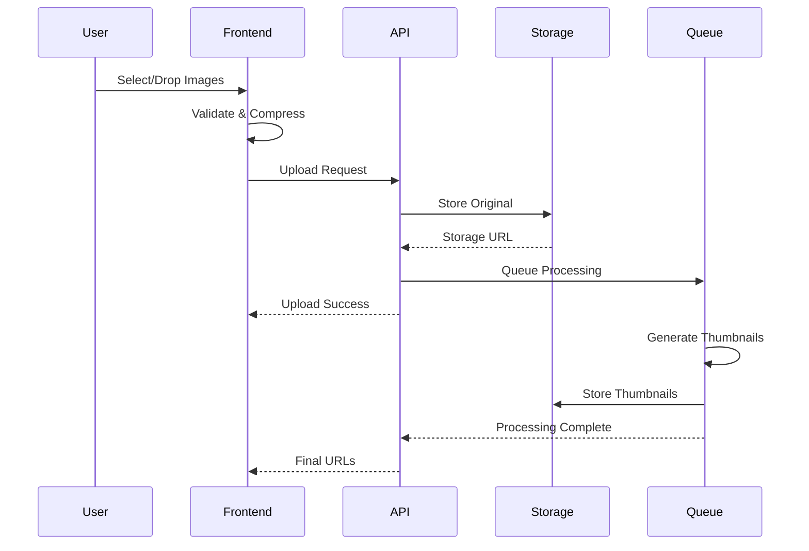

# Implementation Plan: SPEC-UPLOAD-007

## TAG BLOCK
```yaml
spec_id: UPLOAD-007
plan_version: 1.0.0
estimated_duration: 2-days
priority: high
risk_level: medium
```

## Executive Summary

이미지 업로드 시스템을 구현하는 2일간의 집중 개발 계획입니다. Supabase Storage를 활용한 다중 이미지 업로드, WebP 자동 변환, 드래그 앤 드롭 지원을 포함한 완전한 이미지 관리 시스템을 구축합니다.

## Day 1: Core Upload System & Backend

### Morning Session (4 hours)

#### 1. Backend Infrastructure Setup
```yaml
tag: [IMPL-UPLOAD-007-001]
priority: critical
duration: 2-hours
```

**Tasks:**
1. Supabase Storage 버킷 구성
   - `place-images` 버킷 생성
   - 폴더 구조 설정 (place_id/year/month)
   - 액세스 정책 구성
   - CDN 설정 확인

2. Database Schema 구현
   ```sql
   -- images 테이블 생성
   -- image_processing_queue 테이블 생성
   -- 인덱스 및 제약조건 설정
   ```

3. Supabase Functions 설정
   - Image upload handler
   - Thumbnail generation trigger
   - Cleanup functions

**Deliverables:**
- [ ] Storage bucket 활성화
- [ ] Database schema 적용
- [ ] 기본 API endpoints 구성

#### 2. Image Processing Service
```yaml
tag: [IMPL-UPLOAD-007-002]
priority: high
duration: 2-hours
```

**Tasks:**
1. Server-side 이미지 처리 구현
   ```typescript
   // Sharp 기반 이미지 프로세서
   class ImageProcessor {
     async convertToWebP(buffer: Buffer): Promise<Buffer>
     async generateThumbnails(buffer: Buffer): Promise<ThumbnailSet>
     async optimizeImage(buffer: Buffer): Promise<Buffer>
   }
   ```

2. Processing Queue 구현
   - Queue worker 설정
   - Retry 로직 구현
   - Error handling

3. WebP 변환 파이프라인
   - Format detection
   - Conversion logic
   - Quality optimization

**Deliverables:**
- [ ] Image processor 클래스 완성
- [ ] Queue worker 실행
- [ ] WebP 변환 테스트 통과

### Afternoon Session (4 hours)

#### 3. Upload API Implementation
```yaml
tag: [IMPL-UPLOAD-007-003]
priority: critical
duration: 2-hours
```

**Tasks:**
1. REST API Endpoints
   ```typescript
   POST   /api/upload/place/{placeId}/images
   GET    /api/places/{placeId}/images
   PATCH  /api/images/{imageId}
   DELETE /api/images/{imageId}
   PUT    /api/places/{placeId}/images/order
   ```

2. File Validation Middleware
   - Type validation
   - Size checking
   - Malware scanning (basic)
   - Quota enforcement

3. Storage Integration
   - Supabase Storage client setup
   - File upload logic
   - URL generation
   - Cleanup handling

**Deliverables:**
- [ ] All API endpoints functional
- [ ] Validation middleware active
- [ ] Storage integration tested

#### 4. Security & Error Handling
```yaml
tag: [IMPL-UPLOAD-007-004]
priority: high
duration: 2-hours
```

**Tasks:**
1. Security Implementation
   - File type verification (magic bytes)
   - Content sanitization
   - Rate limiting
   - CORS configuration

2. Error Handling System
   ```typescript
   class UploadErrorHandler {
     handleFileTooLarge()
     handleInvalidFormat()
     handleQuotaExceeded()
     handleNetworkError()
   }
   ```

3. Logging & Monitoring
   - Error tracking setup
   - Performance metrics
   - Upload analytics

**Deliverables:**
- [ ] Security measures implemented
- [ ] Comprehensive error handling
- [ ] Monitoring active

### Day 1 Testing Checklist
- [ ] Upload single image successfully
- [ ] Upload multiple images simultaneously
- [ ] WebP conversion working
- [ ] Thumbnails generated correctly
- [ ] Error cases handled properly
- [ ] Security validation passing

## Day 2: Frontend & Integration

### Morning Session (4 hours)

#### 5. Upload UI Components
```yaml
tag: [IMPL-UPLOAD-007-005]
priority: critical
duration: 2-hours
```

**Tasks:**
1. Drag & Drop Component
   ```typescript
   // React Dropzone 구현
   const ImageDropzone: React.FC = () => {
     // Drag & drop logic
     // File selection
     // Visual feedback
   }
   ```

2. Upload Progress UI
   - Progress bars
   - Status indicators
   - Cancel buttons
   - Error displays

3. Image Gallery Component
   - Grid layout
   - Thumbnail display
   - Reordering support
   - Action buttons

**Deliverables:**
- [ ] Dropzone component complete
- [ ] Progress tracking UI
- [ ] Gallery view functional

#### 6. Client-Side Processing
```yaml
tag: [IMPL-UPLOAD-007-006]
priority: medium
duration: 2-hours
```

**Tasks:**
1. Browser Image Optimization
   ```typescript
   class ClientImageProcessor {
     async compressBeforeUpload(file: File): Promise<Blob>
     async generatePreview(file: File): Promise<string>
     async validateDimensions(file: File): Promise<boolean>
   }
   ```

2. Upload Manager Implementation
   - Queue management
   - Concurrent upload control
   - Retry mechanism
   - State persistence

3. Memory Management
   - Blob cleanup
   - Preview optimization
   - Lazy loading

**Deliverables:**
- [ ] Client-side compression working
- [ ] Upload manager functional
- [ ] Memory usage optimized

### Afternoon Session (4 hours)

#### 7. State Management & Integration
```yaml
tag: [IMPL-UPLOAD-007-007]
priority: high
duration: 2-hours
```

**Tasks:**
1. State Management Setup
   ```typescript
   // Zustand store
   interface ImageUploadStore {
     uploads: UploadProgress[]
     images: PlaceImage[]
     addToQueue(files: File[]): void
     updateProgress(id: string, progress: number): void
     removeImage(id: string): void
   }
   ```

2. API Integration
   - Supabase client setup
   - API hooks implementation
   - Error boundary setup
   - Optimistic updates

3. Real-time Updates
   - WebSocket connection
   - Progress streaming
   - Live notifications

**Deliverables:**
- [ ] State management integrated
- [ ] API calls working
- [ ] Real-time updates functional

#### 8. Testing & Polish
```yaml
tag: [IMPL-UPLOAD-007-008]
priority: critical
duration: 2-hours
```

**Tasks:**
1. End-to-End Testing
   - Complete upload flow
   - Error scenarios
   - Edge cases
   - Performance testing

2. UI/UX Polish
   - Loading states
   - Animations
   - Responsive design
   - Accessibility

3. Documentation
   - API documentation
   - Component documentation
   - Usage examples
   - Deployment guide

**Deliverables:**
- [ ] All tests passing
- [ ] UI polished
- [ ] Documentation complete

### Day 2 Testing Checklist
- [ ] Drag & drop working smoothly
- [ ] Multiple file selection functional
- [ ] Progress tracking accurate
- [ ] Gallery view responsive
- [ ] Reordering working
- [ ] Delete functionality
- [ ] Error recovery working
- [ ] Mobile responsive

## Technical Architecture

### Component Structure
```
src/
├── components/
│   ├── upload/
│   │   ├── ImageDropzone.tsx
│   │   ├── UploadProgress.tsx
│   │   ├── ImageGallery.tsx
│   │   └── ImagePreview.tsx
│   └── shared/
│       └── ErrorBoundary.tsx
├── services/
│   ├── imageProcessor.ts
│   ├── uploadManager.ts
│   └── storageClient.ts
├── stores/
│   └── imageUploadStore.ts
├── hooks/
│   ├── useImageUpload.ts
│   └── useImageGallery.ts
└── utils/
    ├── imageValidation.ts
    └── fileHelpers.ts
```

### API Flow Diagram


## Risk Management

### Identified Risks & Mitigations

| Risk | Impact | Mitigation Strategy |
|------|--------|-------------------|
| Large file handling crashes browser | High | Implement chunked reading, limit concurrent processing |
| Supabase rate limiting | Medium | Implement request queuing, exponential backoff |
| WebP conversion fails | Medium | Fallback to JPEG, server-side processing |
| Network interruption during upload | High | Resume capability, local storage for state |
| Memory leaks in preview generation | High | Proper blob cleanup, virtualized gallery |

### Contingency Plans

**If Behind Schedule:**
1. Priority 1: Core upload functionality
2. Priority 2: Image processing
3. Priority 3: UI polish
4. Defer: Advanced features (reordering, batch operations)

**If Technical Blockers:**
1. Supabase issues → Use local storage temporarily
2. WebP not supported → Use JPEG compression
3. Performance issues → Reduce concurrent uploads

## Success Criteria

### Day 1 Complete
- [ ] Backend fully functional
- [ ] API endpoints tested
- [ ] Image processing working
- [ ] Security measures in place
- [ ] Basic upload working via Postman/curl

### Day 2 Complete
- [ ] Full UI implementation
- [ ] Drag & drop working
- [ ] Progress tracking functional
- [ ] Gallery view complete
- [ ] All acceptance criteria met
- [ ] Documentation complete

### Performance Targets
- Upload speed: >80% of network capacity
- Processing time: <10s for 5MB image
- Memory usage: <500MB for 10 concurrent uploads
- UI responsiveness: <100ms interaction delay

## Implementation Notes

### Best Practices
1. **Progressive Enhancement**: Basic upload works without JavaScript
2. **Graceful Degradation**: Fallbacks for older browsers
3. **Accessibility**: Full keyboard navigation, ARIA labels
4. **Performance**: Virtual scrolling for large galleries
5. **Security**: Never trust client-side validation alone

### Code Quality Standards
- TypeScript strict mode
- 90% test coverage
- ESLint compliance
- Proper error boundaries
- Comprehensive logging

### Deployment Checklist
- [ ] Environment variables configured
- [ ] Supabase bucket permissions set
- [ ] CDN configured
- [ ] Monitoring enabled
- [ ] Error tracking active
- [ ] Performance monitoring setup

## Team Coordination

### Day 1 Checkpoints
- 10:00 AM - Backend setup review
- 12:00 PM - Processing service demo
- 03:00 PM - API testing session
- 05:00 PM - Day 1 review & blockers

### Day 2 Checkpoints
- 10:00 AM - UI component review
- 12:00 PM - Integration testing
- 03:00 PM - Full flow demonstration
- 05:00 PM - Final review & deployment

### Communication Channels
- Slack: #image-upload-dev
- Daily standup: 9:00 AM
- Blockers: Immediate escalation
- Code reviews: PR within 2 hours

## Post-Implementation

### Monitoring Setup
1. Upload success rate
2. Average processing time
3. Error frequency
4. Storage usage trends
5. User engagement metrics

### Maintenance Plan
- Weekly performance review
- Monthly security audit
- Quarterly storage optimization
- Continuous user feedback integration

### Future Roadmap
**Week 1-2**: Stabilization and optimization
**Week 3-4**: Advanced features (batch operations)
**Month 2**: AI-powered features
**Month 3**: Video support consideration

---

**Plan Status**: Ready for Execution
**Created**: 2025-11-16
**Team Size**: 2-3 developers
**Dependencies**: Supabase account, CDN setup